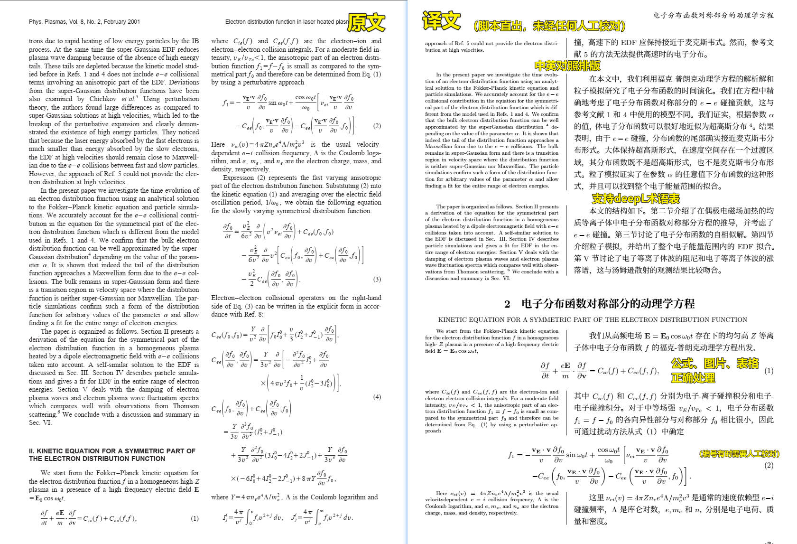
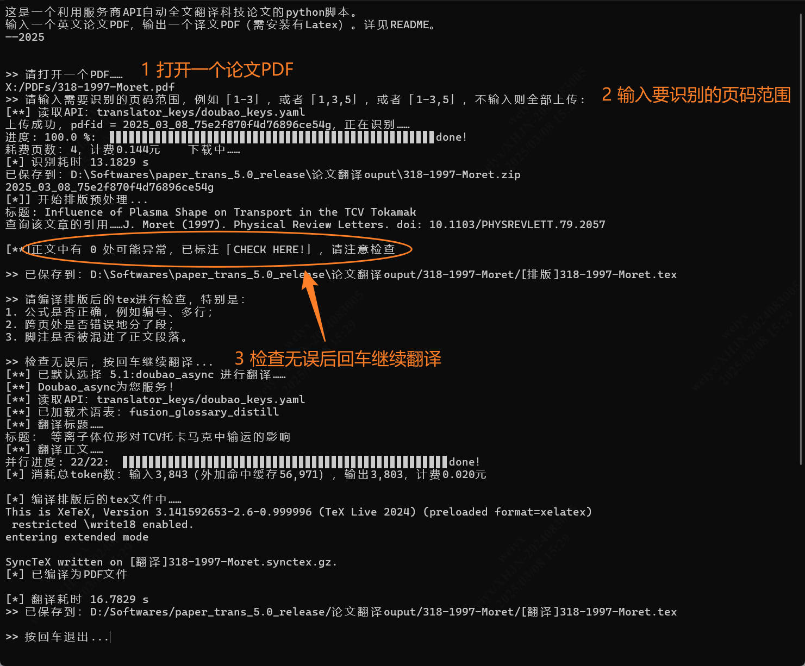
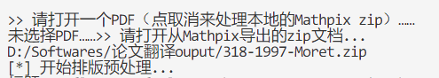
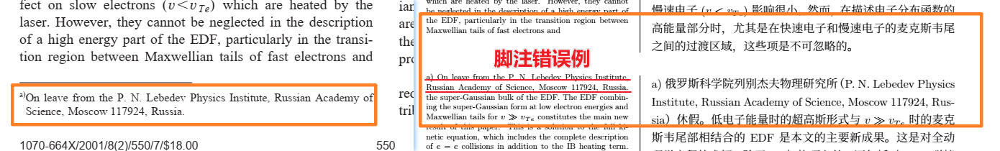

# Paper_translator
这是一个利用服务商API自动全文翻译科技论文的python脚本，需借助Mathpix识别服务。

流程：英文PDF论文→Mathpix识别→翻译（腾讯百度deepL等）→中文PDF

改编自<https://github.com/Humphrey1997/Paper_trans>，这里稍加扩展改编后，打包成了exe，便于使用。

## 更新记录
2025-03-10 15-20-41 v5.0.2：bug修复

2025-03-08 15-09-55 v5.0：终于接入了Mathpix API，现在终于实现了**英文PDF进去、中文PDF出来**的效果，一条龙服务，不再需要自己手动处理PDF了。此外增加了日志功能、查询论文信息（形如 张三 (2021). 某某期刊. doi: 10.123456）的功能。

2025-03-03 13-04-54 v4.6.1：修复了列表环境（itemize，enumerate）翻译后异常的bug。

2025-02-28 09-22-15 v4.6：新增异步并行翻译器"doubao_async"，并相应重写整个翻译流程为异步函数，翻译速度提升10倍以上。同时支持术语表。推荐使用5.1:"doubao_async"！

2025-02-24 18-08-41 v4.5.1：新增翻译器"doubao"，这是字节自家的AI，相比字节部署的deepseek还支持缓存上下文，因此支持了术语表、AI总结全文和问答环节。推荐使用5:"doubao"！

2025-02-17 17-19-35 v4.5：翻译器"openai"改用了deepseek-v3。用的字节部署的版本，暂用我的试用API。


## 功能
还在硬啃英文文章吗？是时候全文翻译了！（该样例见`/样例`）



- 全自动
- 全文翻译，中英对照
- 术语表
- 公式、图片、表格正确处理
- 可自定义模板
- 4.5.1 new! 支持AI问答（在`设置.yaml`中开启）

## 用法
**准备工作**：获取mathpix和翻译器的API，放入`translator_keys/`中，详见下文；安装Latex。

**准备工作**：获取mathpix和翻译器的API，放入`translator_keys/`中，详见下文；安装Latex。

**准备工作**：获取mathpix和翻译器的API，放入`translator_keys/`中，详见下文；安装Latex。

> 因重三！

运行`main.py`来运行本脚本。输入一个英文PDF，输出一个中文pdf。



说明：
- 输入的PDF最好是论文类的，排版复杂的图书效果大抵不好；
- 如果想处理已下载到本地的Mathpix zip文件，在导入pdf时按取消即可

   

- 要识别的页码范围是指：应排除网站自动生成的头页、书籍目录、长篇无需翻译的东西（像博士论文的符号表、参考文献）等；
- 强烈建议翻译前进行排版检查！
- 默认选择的翻译器可在`设置.yaml`中调整；
- 如自动编译PDF不成功，可手动打开`[翻译]*.tex`文件来自行检查编译

### 排版检查

为什么要停顿？因为**排版后的文档应该经过人工检查后，再运行翻译脚本进行翻译！**

这是因为mathpix机能所限，有些地方识别得不准确。**需要着重检查的地方已在程序中标出（标注 CHECK HERE）**。比如：
1. **跨页断段**。默认一页底部的文字会和下一页开头直接衔接，有时却没有衔接，导致错误。
2. **脚注**。本翻译器对脚注`\footnote`的兼容性较差，往往会出错，删去所有脚注，或以括号合并到正文中去。
   
3. **行间公式被误认为行内公式**。行间公式如果顶到一行开头，会被mathpix误认为是一行正文，被识别成行内公式。需要手动改过来。

**tips：**
1. 翻译API大都是付费的，如你想在正式翻译前试验一下，可在翻译器选择时选择`9:test`，你试一下就知道是怎么回事了。
2. 裹在latex命令里的文本（例如加粗、脚注等）一律保持原文不翻译，请在排版时注意。

### 配置
有两个东西可以配置：

1. 排版模板`template.tex`，特别是其中可以自定义中文对照的模式：
   - 重中文的四六开排版，
   - 中英文同重的五五开排版，
   - 仅中文或仅英文的排版。
2. 处理设置`设置.yaml`，
   - 设置存放着API keys的目录，
   - 将`"立即编译所得tex"`设为`1`，来自动将排版/翻译所得的tex文件编译成pdf，注意需要安装了Latex，
   - 某几个翻译器可以设置术语表
   - 其它杂项


默认模板中用思源宋体作为正文字体，因为latex自带宋体字库太小了。下载：[思源宋体 CN](https://github.com/adobe-fonts/source-han-serif/releases/download/2.002R/14_SourceHanSerifCN.zip)。

#### 术语表

在`glossaries\`目录中。每个文件就是一个术语表。

术语表是csv文本文件，逗号前是英文，逗号后是中文。英文不能有重复。

目前只有`4:deepl`和`5:doubao`、`5.1:doubao_async`翻译器支持术语表，在`设置.yaml`中设置使用哪个术语表，一次只能用一个术语表。不用术语表的话指定为`void`即可。

#### AI总结

选择翻译器`5:doubao`，且`设置.yaml`中设置`doubao-AI总结: 1`时，AI将完整理解整篇文章，并给出AI总结放在译文PDF的开头，并且你还以可以问AI问题。

受限于AI的上下文长度限制，不可用于长度超过20页的文章。 

## 准备工作
### Mathpix服务
你需要开通Mathpix API来识别pdf
- 网址：<https://mathpix.com/pricing/api>
- 价格（2025.3）：0.005美元/页PDF ，开通API付费20美元得30美元（6000页）

### 翻译服务
本脚本依靠公开的翻译服务API来工作，这里写好了几个服务的接口，这些API服务有付费的有免费的：
- doubao （推荐，价格便宜，效果很好）
- deepseek（效果也好，但价格是doubao的4倍）
- chatGPT （需付费和外国信用卡）
- deepL （免费但需外国信用卡）
- 腾讯 （免费）
- 百度 （免费）

doubao是字节跳动自家的大模型，开通API见[火山方舟](https://www.volcengine.com/product/ark)→控制台，另有包括deepseek在内的多种模型可以选择。

其它申请API方法可见<https://hcfy.app/docs/services/deepl>。

申请到密钥后，在`translator_keys`文件夹中对应的文件加入自己的密钥即可。

>大模型（doubao、deepseek等）的翻译效果是最好的，推荐使用字节的火山方舟平台，服务稳定价格实惠。用doubao翻译一篇10页的论文，不带术语表约0.03元，带术语表约0.06元。
>
>"openai"翻译器是通用API接口，各AI API平台都支持，字节的火山方舟也支持，可在该接口下使用deepseek、ChatGPT等。但是不支持术语表。
>
>deepL的翻译质量尚可，其免费API：DeepL API Free（每月50万字符）虽然国内不能正常开通，但可以在某宝黄牛买到，一般价10元/个。可以一次买多个，本脚本特地针对此开发了自动换弹夹的功能~

### Latex编译pdf
这一点请自寻教程。对初学者来说，推荐texLive + TexStudio的组合：
- texlive下载：https://mirrors.tuna.tsinghua.edu.cn/CTAN/systems/texlive/Images/
- texstudio下载：https://mirrors.tuna.tsinghua.edu.cn/github-release/texstudio-org/texstudio/LatestRelease/

> `设置.yaml`里`"立即编译所得tex"`的功能必须装了latex编译器（比如texlive）才能用


## 依赖与流程
需要安装的包：
```
pip install --upgrade requests deepl openai volcengine-python-sdk[ark]
```

> **特别注意**：在安装字节跳动的volcengine-python-sdk[ark]前必须解除windows系统路径名长度的限制，否则会安装失败！打开一个有管理员权限的命令行窗口，运行：
>```
>reg add "HKLM\SYSTEM\CurrentControlSet\Control\FileSystem" /v "LongPathsEnabled" /t reg_dword /d 1 /f
>```

本脚本的运行原理分为三步：
- 识别，运行`PDF_OCR.py`，上传pdf到mathpix来识别成latex文件。
- 排版，运行`TYPESET.py`，用来将mathpix导出的latex文件初步处理。
- 翻译，运行`TRANSLATE.py`，用来进行翻译并生成中英对照的latex文档。

`main.py`就是顺序运行这三个脚本，并自动在中间停顿。日志记录于`log*.txt`。

脚本的主要流程是：疯狂地正则替换
1. 运行`TYPESET.py`,
   -  打开一个从mathpix上下载的tex文件，逐行读取；
   -  调用`typeset_func2.py`中的一系列函数，完成对标题作者摘要、正文、公式、图表的排版工作；
   -  在原文件同目录保存，并加前缀`[排版]`。
2. 运行`TRANSLATE.py`,
   - 打开上述前缀`[排版]`的文件，逐行读取；
   - 调用`translate_func2.py`中的一系列函数，让用户选择这次用哪个翻译器进行翻译，并读取`translators`文件夹里的对应翻译器；
   - 加载对应的API key和术语表，逐行对文档进行翻译；
   - 翻译完成后再做一些小装饰后， 在原文件同目录保存，并加前缀`[翻译]`。

额外小功能：
- 可以直接运行`translate_func2.py`文件，是一个实时翻译器，你输入一句，它翻译一句。可用于测试或翻译检查时查漏补缺。