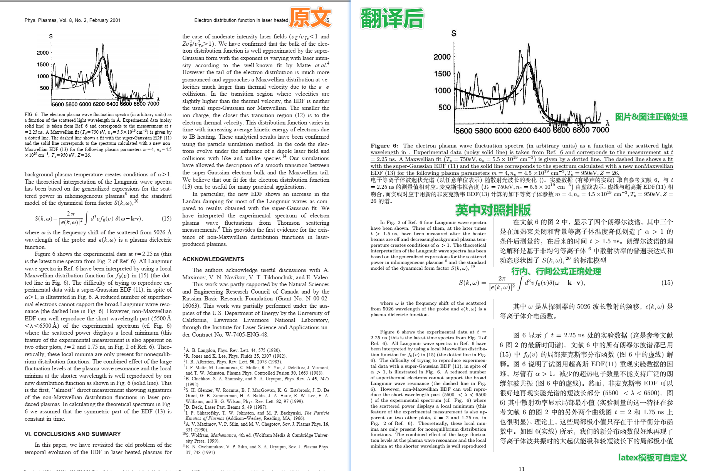

# Paper_translator
这是一个利用服务商API自动全文翻译科技论文的python脚本，需借助Mathpix识别服务。

路径：英文PDF论文→Mathpix识别→翻译（腾讯/百度/deepL/ChatGPT）→中文PDF

改编自<https://github.com/Humphrey1997/Paper_trans>，这里稍加扩展改编，并打包成了exe便于使用。

## 功能
还在硬啃英文文章吗？是时候全文翻译了！（该样例见release）


- 全自动排版、翻译
- 中英对照
- 公式、图片、表格正确处理
- 可自定义模板

## 用法
运行`main.py`即可。

但在此之前你需要准备：
### 获取tex文件
你需要使用Mathpix来识别pdf，生成tex文件，再送入本脚本来处理。
- 网址：<https://snip.mathpix.com>
- edu邮箱用户每月20页免费额度，再往上需要付费会员。

### 翻译服务
本脚本依靠公开的翻译服务API来工作，这里写好了四个服务的接口，这些API服务有付费的有免费的：
- chatGPT （需付费和外国信用卡）
- deepL （免费但需外国信用卡）
- 腾讯 （免费）
- 百度 （免费）

申请这些API的方法可见<https://hcfy.app/docs/services/deepl>。

申请到密钥后，在`translator_keys`文件夹中加入自己的密钥即可，详见那里的readme。

### Latex编译pdf
这一点请自寻教程。对初学者来说，推荐texLive + TexStudio的组合。

## 使用TIPS
● 你可以直接运行`main.py`来一键运行，也可以分手动先后运行`TYPESET.py`和`TRANSLATE.py`来自己控制节奏。

● 排版的latex**模板**是`template.tex`，阁下可以根据自己的喜好进行修改。注意其中以`% ==`开头的注释（如`% ==document body begins`）是本脚本的识别位点，不可删改，否则将导致运行错误。

● 之所以排版和翻译中间要暂停叫使用者检查，是因为mathpix的识别功能虽然已经高度成熟，但是仍然偶尔有翻车的地方，特别是下面容易被忽略的几个方面：
1. **公式**是否正确，例如编号、多行；
2. **跨页**处、**跨图片**处是否被错误地分了段；
3. **脚注**是否被混进了正文段落。

另外请注意：本翻译器是将正文逐段翻译的，是以`\n`为分段，而非像latex以空行为分段，所以阁下整理排版的时候，注意删除多余的换行。

● 当一次排版（运行TYPESET）之后，可以先用**假文**检查一下成品翻译的排版，即在运行TRANSLATE时选择`'5': 'test'`：
```
选择翻译器{'1': 'baidu', '2': 'tencent', '3': 'openai', '4': 'deepl', '5': 'test'}：5
```
这是用假文脚本<https://github.com/DertahSama/zh_lorem_python>生成的专供排版检查的东西，可以在不消耗翻译API额度的情况检查翻译板式运作是否正常。

● 在2023.7，在这四个翻译api中实测deepL翻译的质量最好，但是deepL的免费api申请需也要外国信用卡，但可以直接在万能的某宝上购买开通了api的账号。不过，只有百度翻译api支持自定义中英翻译术语表。


